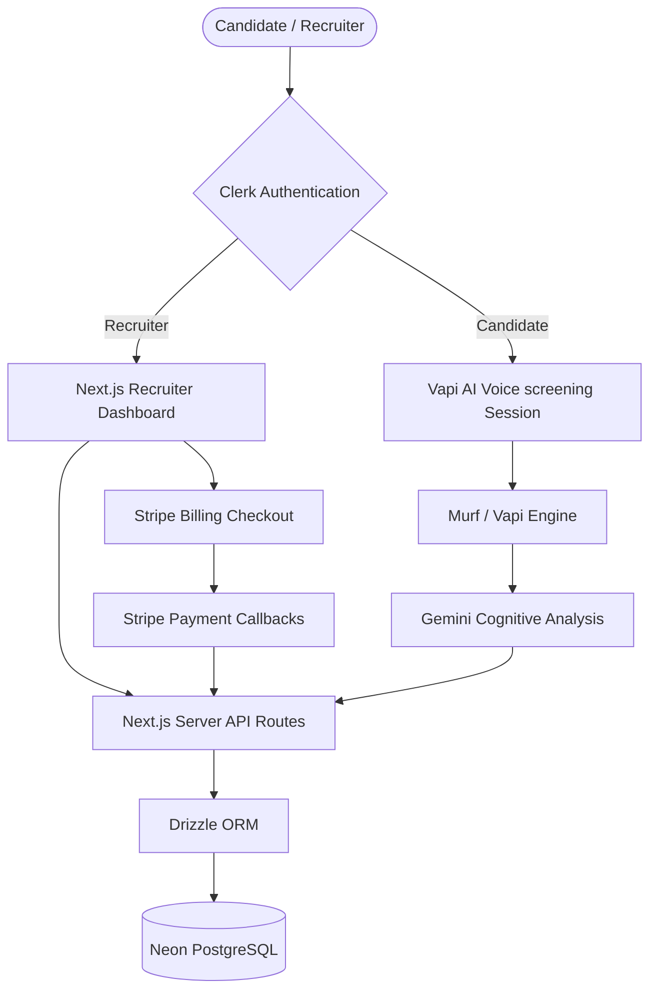
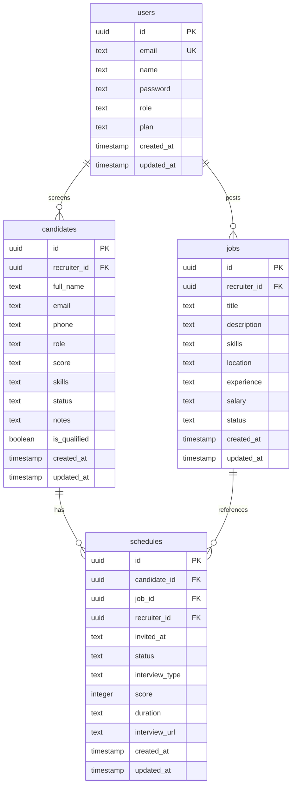

# VocalHire - AI Recruiter Voice Agent System Documentation

VocalHire is a state-of-the-art recruitment portal that leverages AI-driven voice screening agents to conduct automated voice interviews with candidates, analyze their qualifications, and present recruitment pipelines to employers in a beautiful, unified dashboard.

---

## 1. Technology Stack

VocalHire is built using a modern, performant, and type-safe software stack:

### Frontend
- **Framework**: **Next.js 15 (App Router)** - React framework providing server-side rendering (SSR), optimized build caching, routing, and backend API routes.
- **Styling**: **Vanilla CSS & TailwindCSS** - Sleek, glassmorphic dark mode styling using curated color palettes (deep slate, violet, and electric blue).
- **Icons**: **Lucide React** - High-quality consistent icons.
- **Components**: **Radix UI Primitive Components** - Secure, accessible, and interactive modal/dropdown primitives.

### Backend & Databases
- **Runtime Environment**: **Node.js** with Next.js Server Components and Server Actions.
- **Database**: **PostgreSQL (hosted on Neon Database)** - Fully managed, serverless, scale-to-zero database cluster.
- **ORM**: **Drizzle ORM** - Type-safe SQL query builder and schema management utility.
- **Migrations & Seeding**: Self-healing custom initialization runtime script that checks tables, inserts seeds, and updates missing schema structures on demand.

### APIs & Key Integrations
- **Authentication**: **Clerk Auth** - Cloud-based user session manager with social logins, custom sign-in/sign-up components, and JWT session claims.
- **Payment Gateway**: **Stripe REST API** - Configured for secure subscription models (Pro & Enterprise tiers) using test secret/publishable key configurations and checkout callbacks.
- **Speech & AI Integration**: 
  - **Gemini API**: AI cognitive processing for analyzing interview results and resumes.
  - **Murf API**: Speech-to-text and text-to-speech generation.
  - **Vapi**: Immersive real-time conversational voice agents for candidate screening.

---

## 2. Architecture & Design

### System Workflow Diagram


### Relational Database Schema (Drizzle ORM)


---

## 3. Features & Functional Specifications

### 1. Recruiter Dashboard Home
- **Live Statistics Cards**: Dynamically queries Postgres to return System-wide counts:
  - **Active Jobs**: Total count of jobs with status `'Active'`.
  - **Total Candidates**: Total candidate profiles loaded in the recruitment pipeline.
  - **Interviews Scheduled**: Total scheduled screening calls.
  - **Screening Rate**: Metric of screened vs. invited candidates.
- **Recent Activities Feed**: Real-time audit trail of actions taken in the database (e.g., job posted, candidates screened, interviews scheduled) sorted chronologically.

### 2. User Authentication & Session Control
- Fully secured routes under the Clerk Next.js SDK.
- **Clerk `<SignOutButton>` integration**: A nested wrapper insideRadix Dropdown menu controls to prevent bubble propagation and ensure clean user sign-out redirects.
- **Resilient Claim Authentication**: Fetches user credentials directly from local JWT tokens (`sessionClaims`) which allows the server to verify the user locally, remaining immune to network connection drops to Clerk's profile server.

### 3. Stripe Billing & Upgrade Plan Gateway
- **Pro Recruiter Plan ($49/month)**: Unlocks up to 100 AI voice interviews per month, interactive dashboard analysis, and premium support.
- **Enterprise Plan ($199/month)**: Unlocks unlimited voice screening, custom voice coach configurations, and API voice cloning capabilities.
- **Dynamic Stripe Session Engine**:
  - Generates checking tokens and contacts `api.stripe.com/v1/checkout/sessions`.
  - If API keys are missing or invalid, it redirects cleanly to a sandboxed Mock Checkout simulator (`/dashboard/checkout-mock`) to avoid system crashes.
  - Success Callbacks update the Neon DB column `users.plan` instantly to unlock tier features.

### 4. Job Posting Management
- Allows recruiters to draft, save, edit, and publish job roles.
- Details collected: title, target skills, salary range, experience levels, and active statuses.

### 5. Candidate Audits & AI Screening
- Candidate profiles are cataloged with qualification indicators, resume skills list, and status flags.
- System allows inviting a candidate to an automated AI voice interview session, generating a dedicated screen link.

---

## 4. API Endpoints Reference

### 1. Plan Configurations
* **`GET /api/user/plan`**
  - **Auth**: Required
  - **Description**: Returns the active subscription tier of the logged-in user.
  - **Returns**: `{ "plan": "free" | "pro" | "enterprise" }`

### 2. Billing Checkout
* **`POST /api/stripe/checkout`**
  - **Auth**: Required
  - **Body Parameter**: `{ "plan": "pro" | "enterprise" }`
  - **Description**: Sets up standard billing session redirecting the browser to Stripe Checkout or Mock Checkout.
  - **Returns**: `{ "url": "https://checkout.stripe.com/..." }`

* **`GET /api/stripe/callback`**
  - **Query Parameters**: `session_id`, `plan`
  - **Description**: Verifies payment validation with Stripe API and upgrades `users.plan` inside PostgreSQL.

### 3. Jobs Endpoint
* **`GET /api/jobs`**
  - **Description**: Returns all job postings.
* **`POST /api/jobs`**
  - **Description**: Creates a new job posting.

---

## 5. Deployment & Configuration

### Required Environment Variables (`.env.local`)
Create a `.env.local` file in your root folder and set the following parameters:

```env
# Database Connection (Neon Serverless PostgreSQL URL)
DATABASE_URL=postgresql://...

# Clerk Authentication Keys
NEXT_PUBLIC_CLERK_PUBLISHABLE_KEY=pk_test_...
CLERK_SECRET_KEY=sk_test_...
NEXT_PUBLIC_CLERK_SIGN_IN_URL=/sign-in
NEXT_PUBLIC_CLERK_SIGN_UP_URL=/sign-up

# Stripe Payment Gateway Keys
NEXT_PUBLIC_STRIPE_PUBLISHABLE_KEY=pk_test_...
STRIPE_SECRET_KEY=sk_test_...

# AI Speech and Audio API Credentials
GEMINI_API_KEY=...
MURF_API_KEY=...
```

### Starting the Application
To run the server locally:
```bash
# Install package dependencies
npm install

# Start Next.js development server
npm run dev
```

---

## 6. How to Export this Document to PDF

To convert this comprehensive architecture documentation into a PDF:
1. Open this file in **VS Code**.
2. Install the **Markdown PDF** extension (by *yzane*).
3. Right-click anywhere in this markdown file.
4. Select **Markdown PDF: Export (pdf)**. A high-quality single PDF file will be created in your workspace!
